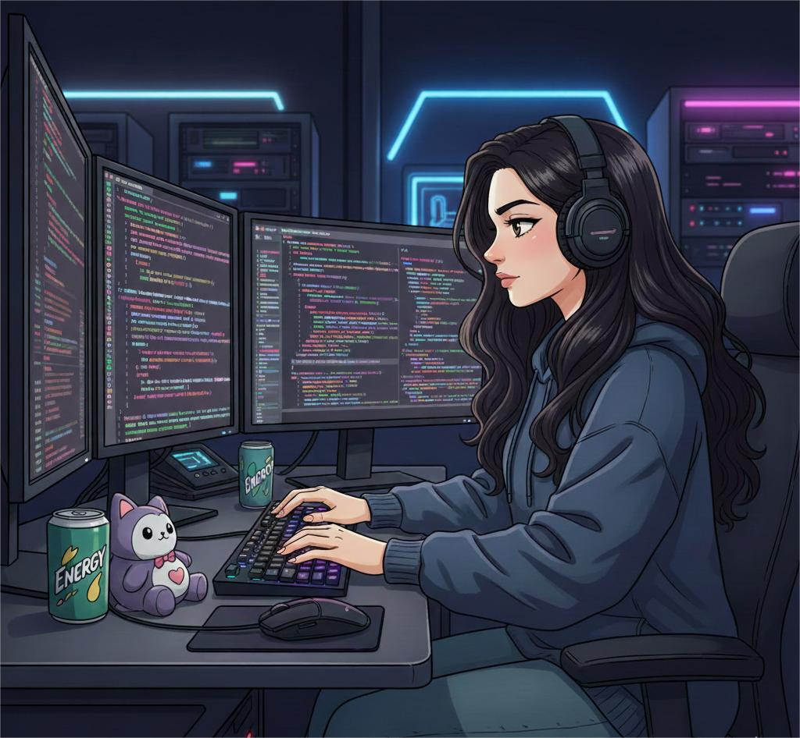

<!-- ──────────────────────────────── 🌿 INTRO / HEADER ──────────────────────────────── -->

  
<em>One step at a time!</em>

<h2 align="center">👋 Hello World! I'm <b>Swati Tanu</b></h2>
<h4 align="center">A solution-driven Software Engineer passionate about scalable systems, clean code & real-world problem solving.</h4>

---

<!-- ────────────────────────── ⌨️ Typing Animation Banner ────────────────────────── -->

  
  

 

<!-- ─────────────────────────────────── 📊 Stats / Banner ─────────────────────────────────── -->

    

  

---

<!-- ───────────────────────────────── 📌 ABOUT ME ───────────────────────────────── -->
### 🚀 About Me

- 🔭 Currently building **Full-Stack Projects & Scalable APIs**
- 🌱 Learning **System Architecture | Cloud DevOps**
- 💬 Ask me about **Backend, Frontend, Databases & Optimization**
- 🧠 Always exploring new ideas & tech experiments
- 📁 Portfolio: <a href="https://swatitanu.netlify.app/" target="_blank"><b>Click Here</b></a>

---

<!-- ─────────────────────────────── 💻 TECH STACK ─────────────────────────────── -->
### 🧠 Tech Stack

<!-- Frontend -->

 

<!-- Backend -->

 

<!-- Databases -->

 

<!-- Languages -->

---

<!-- ─────────────────────────── 🏆 ACHIEVEMENTS TABLE ─────────────────────────── -->
### 🏆 Achievements & Highlights

| 🔹 What I Do | 🔥 Impact |
|---|---|
| Build full-stack applications | Used by real users |
| Improve backend performance | Up to ~30% faster responses |
| Structure modular + scalable codebases | Better maintainability |
| Open-source contributions | Shared knowledge & enhancements |
| Passionate learner | Consistent growth mindset |

---

<!-- ─────────────────────────── ⭐ TROPHIES ─────────────────────────── -->
### 🏅 GitHub Trophy Wall

  

---

<!-- ─────────────────────────── 📈 CONTRIBUTION GRAPH ─────────────────────────── -->
### 📈 Activity & Contributions

  

---

<!-- ─────────────────────────── 🌟 AUTO MOTIVATION ─────────────────────────── -->
### 🌟 Auto-Updating Motivation

  

---

<!-- ─────────────────────────── 🔗 SOCIAL LINKS ─────────────────────────── -->
### 🔗 Connect With Me

  
  

---

⭐ <b>If you like my projects, don't forget to star them!</b>
